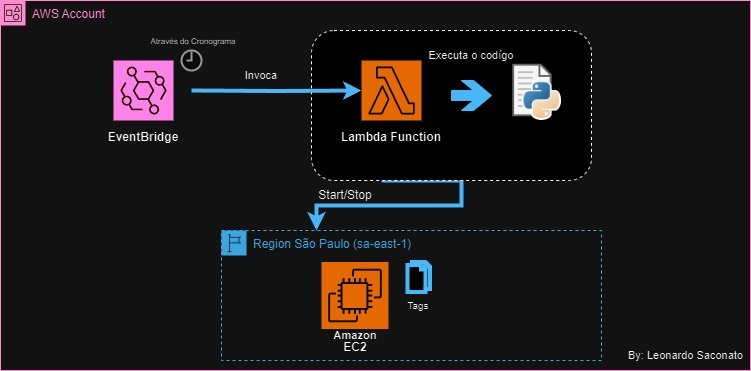

# Automação de Start & Stop instância EC2

Estudo de caso (baseado em um cenário real): A empresa "X" possui uma instância EC2 na nuvem AWS, esta instância é utilizada como um servidor de aplicação, a empresa sempre se preocupou em fazer a inicialização e desligamento da instância, afim de diminuir custos, esse start/stop da instância era realizado manualmente, alguns dias/semanas a maquina não estava sendo desligada ou ligada nos horários corretos, assim elevando muito os custos de operação da instância, proponha uma solução para a instância iniciar e desligar de forma automatica nos dias e horários definidos:

* **Dias de funcionamento:** Segunda à Sexta-feira
* **Horário:** 07:00 às 17:00

## Existem diversas maneiras para solicionar este problema, optei pela utilização dos serviços AWS:

 * [IAM](https://aws.amazon.com/pt/iam/)
 * [Lambda](https://aws.amazon.com/pt/lambda/?nc2=type_a) 
 * [CloudEventBrigde](https://aws.amazon.com/pt/eventbridge/)

## Implementação 

Primeiramente, foi configurado no serviço IAM(Identity and Access Management) a política e regra para o serviço AWS lambda ter acesso a EC2.
No Serviço AWS Lambda foi configurado a função com base na política criada, o código desenvolvido na linguagem Python. Por fim foi criado no serviço EventBrigde um cronôgrama, onde fará o acionamento da função Lambda Start/Stop.

Após a implementação dos procedimentos, foi possível resolver o desafio proposto. 